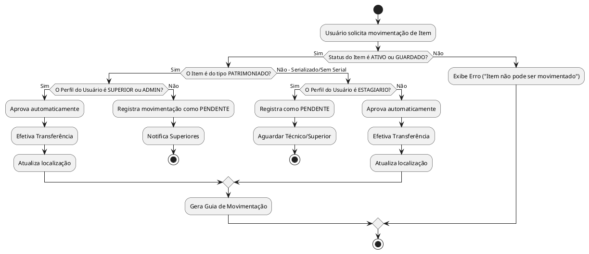

# Diagrama de Atividade

Este diagrama descreve o fluxo lógico de decisão que o sistema executa quando um usuário tenta solicitar uma movimentação.

```plantuml
@startuml
start

:Usuário solicita movimentação de Item;

if (Status do Item é ATIVO ou GUARDADO?) then (Sim)
  if (O Item é do tipo PATRIMONIADO?) then (Sim)
    if (O Perfil do Usuário é SUPERIOR ou ADMIN?) then (Sim)
      :Aprova automaticamente;
      :Efetiva Transferência;
      :Atualiza localização;
    else (Não)
      :Registra movimentação como PENDENTE;
      :Notifica Superiores;
      stop
    endif
  else (Não - Serializado/Sem Serial)
    if (O Perfil do Usuário é ESTAGIARIO?) then (Sim)
      :Registra como PENDENTE;
      :Aguardar Técnico/Superior;
      stop
    else (Não)
      :Aprova automaticamente;
      :Efetiva Transferência;
      :Atualiza localização;
    endif
  endif
  :Gera Guia de Movimentação;
else (Não)
  :Exibe Erro ("Item não pode ser movimentado");
endif

stop
@enduml
```
