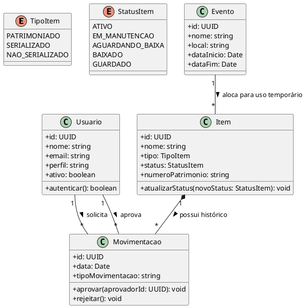

# Diagrama de Classes

Este diagrama abstrai a estrutura TypeScript que deve guiar a construção do Frontend e do Backend.

### Notas de Implementação
A modelagem orientada a objetos (TypeScript) espelha as regras descritas no banco. Componentes do frontend devem consumir estas interfaces em suas propriedades.
