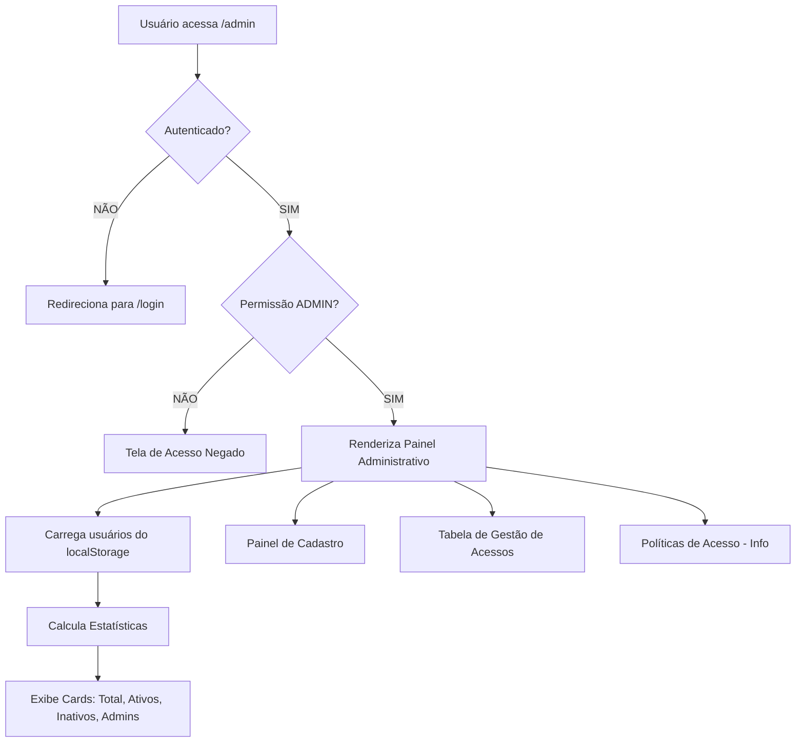
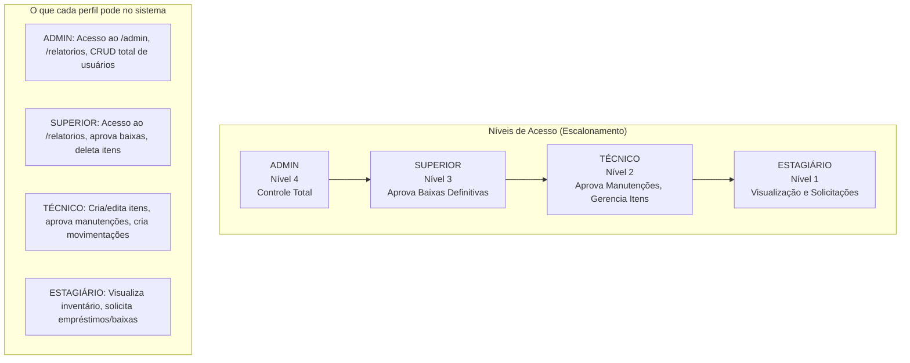
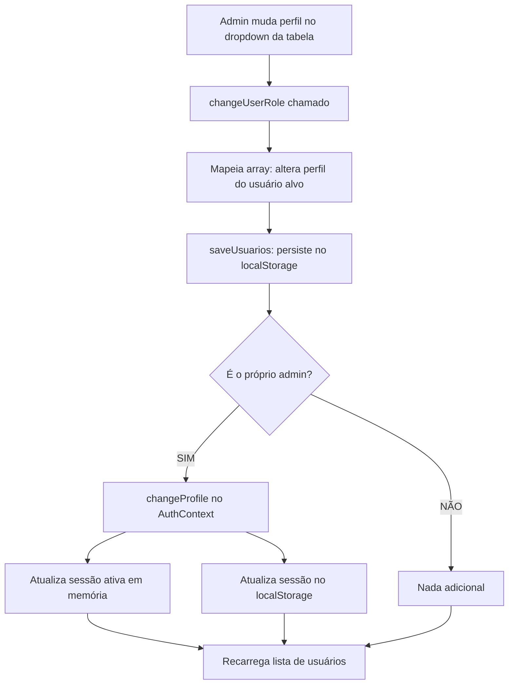
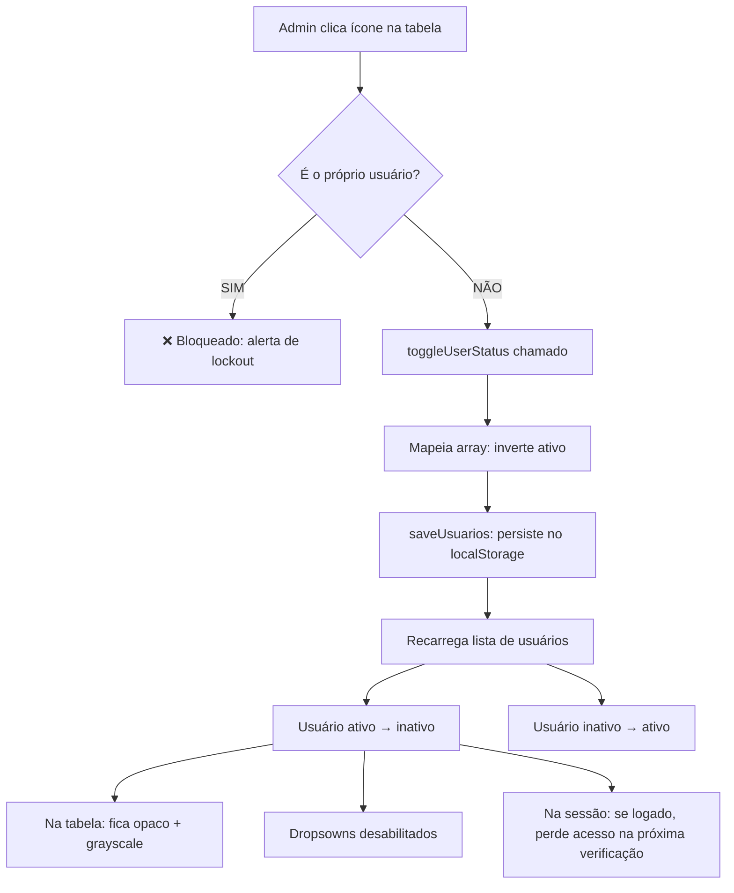
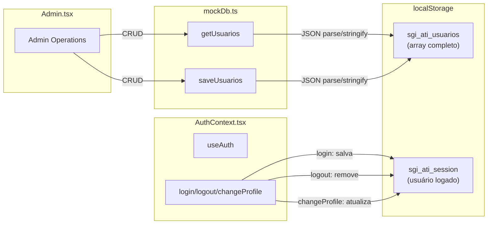
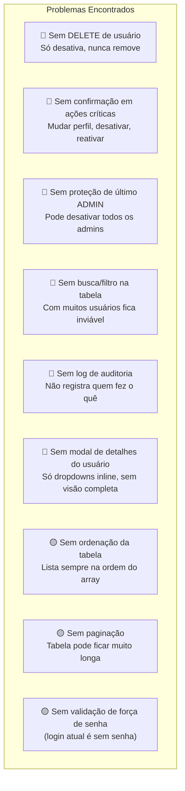
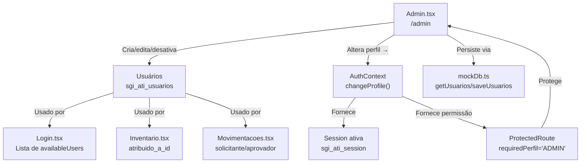

# Diagrama de Comportamento - Painel Administrativo (SGI-ATI)

## 1. Fluxo de Acesso ao Painel Admin



## 2. Hierarquia de Perfis (Permissionamento)



## 3. Fluxo de Cadastro de Usuário

```mermaid
flowchart TD
    A[Admin preenche formulário] --> B{Validação Zod}
    B -->|Nome < 3 chars| C[Erro: Nome inválido]
    B -->|Email inválido| D[Erro: Formato de email]
    B -->|Sucesso| E{Email já existe?}
    E -->|SIM| F[Erro: Email duplicado]
    E -->|NÃO| G[Cria objeto Usuario]
    
    G --> H[id = usr-{timestamp}]
    G --> I[ativo = true]
    G --> J[polo = opcional]
    
    H & I & J --> K[saveUsuarios: append ao array]
    K --> L[Persiste no localStorage]
    L --> M[Limpa formulário]
    M --> N[Exibe mensagem de sucesso]
    M --> O[Recarrega lista de usuários]
```

## 4. Fluxo de Alteração de Perfil (Inline no Select)



**⚠️ Ponto frágil detectado:** Se o admin se rebaixar para um perfil menor que ADMIN, ele perde acesso imediato ao /admin (o ProtectedRoute bloqueia). Isso é intencional mas não há confirmação.

## 5. Fluxo de Ativação/Desativação (Toggle)



**⚠️ Ponto frágil detectado:** Se o admin desativa outro admin sendo o único admin, qual o impacto? O usuário desativado ainda pode estar com sessão ativa. Não há verificação de "último admin".

## 6. Fluxo de Persistência (localStorage)



## 7. Componentes e Responsabilidades do Admin.tsx

```mermaid
flowchart TD
    subgraph "Admin.tsx (Atual - 408 linhas)"
        S1[Stats Cards<br/>Total, Ativos, Inativos, Admins]
        S2[Form Cadastro<br/>Nome, Email, Perfil, Polo]
        S3[Tabela Usuários<br/>Linhas com dropdowns inline]
        S4[Info Políticas<br/>Descrição textual dos perfis]
    end
    
    S2 --> V1[Zod Validation]
    S2 --> V2[Email Duplicado Check]
    S2 --> V3[Auto ID: usr-timestamp]
    
    S3 --> A1[Change Perfil Dropdown]
    S3 --> A2[Change Polo Dropdown]
    S3 --> A3[Toggle Ativo/Inativo Botão]
    S3 --> A4[Marcação "Você" no usuário atual]
    S3 --> A5[Inativos: opacidade + dropdowns disabled]
    
    S1 --> C1[useMemo: recalcula ao mudar usuarios]
```

## 8. Lacunas e Problemas Detectados



## 9. Relacionamento Admin ↔ Outros Módulos



## 10. Regras de Negócio do Painel Admin

| # | Regra | Status Atual |
|---|-------|-------------|
| R01 | Apenas ADMIN acessa o /admin | ✅ Implementado via ProtectedRoute |
| R02 | ADMIN não pode desativar a si próprio | ✅ Implementado (alerta no toggle) |
| R03 | ADMIN pode alterar o próprio perfil (com risco de lockout) | ✅ Implementado (sem confirmação) |
| R04 | Email deve ser único no cadastro | ✅ Implementado (verificação case-insensitive) |
| R05 | Nome deve ter entre 3-50 caracteres | ✅ Implementado (Zod) |
| R06 | Usuários inativos não podem logar | ✅ Implementado (login verifica ativo) |
| R07 | Perfis seguem hierarquia numérica (1-4) | ✅ Implementado (hasPermission) |
| R08 | Polo é opcional no cadastro | ✅ Implementado |
| R09 | Deve existir pelo menos 1 ADMIN ativo | ❌ Não implementado |
| R10 | Ações administrativas devem ter log | ❌ Não implementado |
| R11 | Deve ser possível excluir usuário | ❌ Não implementado |
| R12 | Confirmação em ações destrutivas | ❌ Não implementado |
