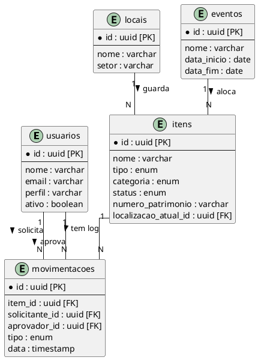

# Diagrama Entidade-Relacionamento (ER)

O diagrama ER consolida a visão relacional do banco de dados (PostgreSQL/Supabase), demonstrando tabelas, chaves primárias/estrangeiras e multiplicidade.

Este esquema garante que consultas sobre "Onde está o item X" sejam resolvidas através do `localizacao_atual_id`, enquanto "Como o item X chegou lá" é extraído da tabela `movimentacoes`.
