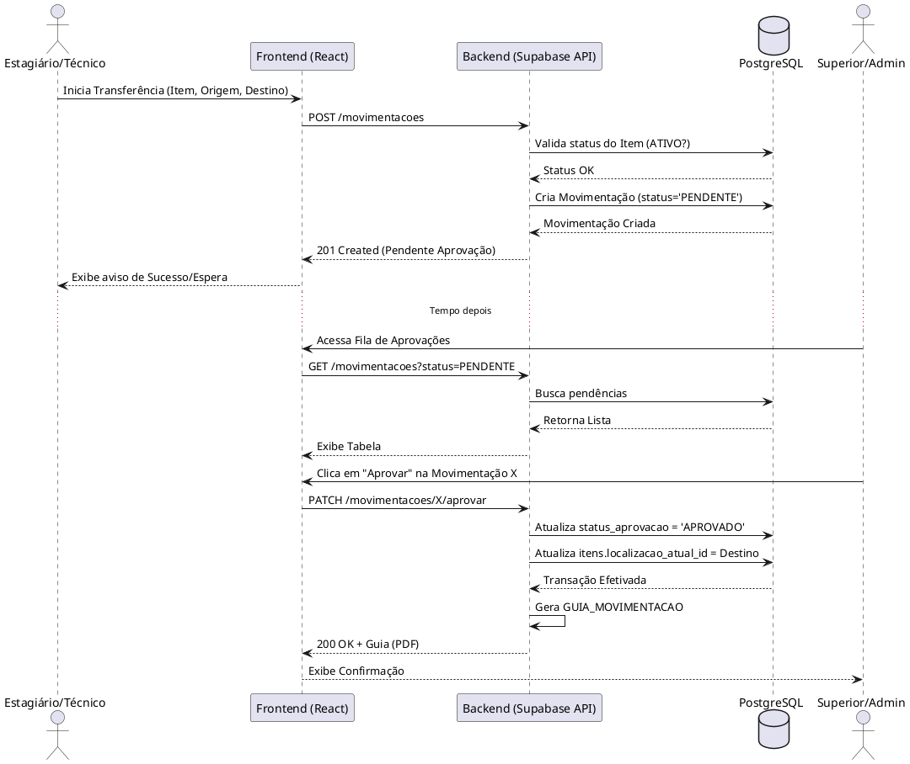

# Diagrama de Sequência

O diagrama de sequência a seguir ilustra o fluxo crítico de **Transferência de Item Patrimoniado com Aprovação**, garantindo rastreabilidade e governança.

```plantuml
@startuml
actor "Estagiário/Técnico" as tecnico
participant "Frontend (React)" as front
participant "Backend (Supabase API)" as api
database "PostgreSQL" as db
actor "Superior/Admin" as superior

tecnico -> front: Inicia Transferência (Item, Origem, Destino)
front -> api: POST /movimentacoes
api -> db: Valida status do Item (ATIVO?)
db --> api: Status OK
api -> db: Cria Movimentação (status='PENDENTE')
db --> api: Movimentação Criada
api --> front: 201 Created (Pendente Aprovação)
front --> tecnico: Exibe aviso de Sucesso/Espera

... Tempo depois ...

superior -> front: Acessa Fila de Aprovações
front -> api: GET /movimentacoes?status=PENDENTE
api -> db: Busca pendências
db --> api: Retorna Lista
api --> front: Exibe Tabela
superior -> front: Clica em "Aprovar" na Movimentação X
front -> api: PATCH /movimentacoes/X/aprovar
api -> db: Atualiza status_aprovacao = 'APROVADO'
api -> db: Atualiza itens.localizacao_atual_id = Destino
db --> api: Transação Efetivada
api -> api: Gera GUIA_MOVIMENTACAO
api --> front: 200 OK + Guia (PDF)
front --> superior: Exibe Confirmação

@enduml
```
