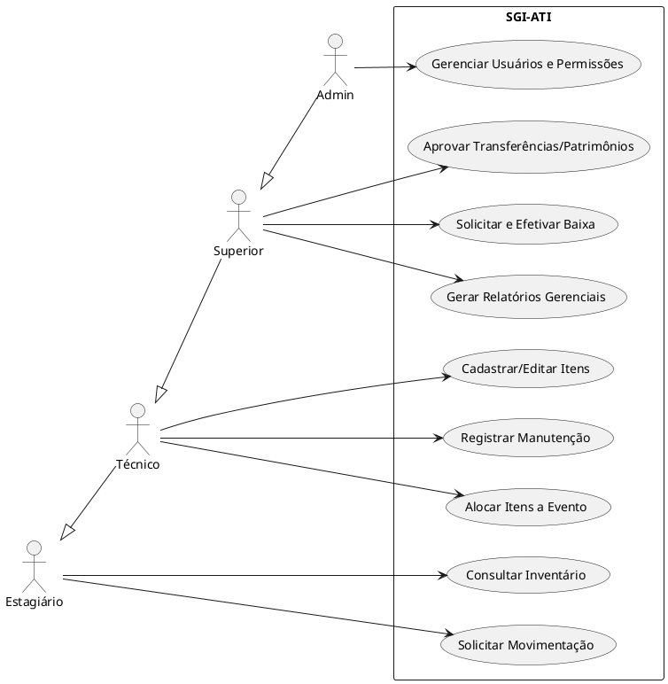

# Diagrama de Casos de Uso (Use Cases)

Este diagrama demonstra as interações entre os atores do sistema (Perfis de Usuário) e as funcionalidades principais do SGI-ATI.

### Explicação dos Relacionamentos
- **Estagiário:** Ações de leitura e solicitações (não-destrutivas e não-conclusivas).
- **Técnico:** Herda permissões do Estagiário e executa as rotinas operacionais plenas.
- **Superior:** Herda operações do Técnico e adiciona ações de governança (Baixas, Aprovações, Relatórios).
- **Admin:** Possui controle total, incluindo administração sistêmica.
