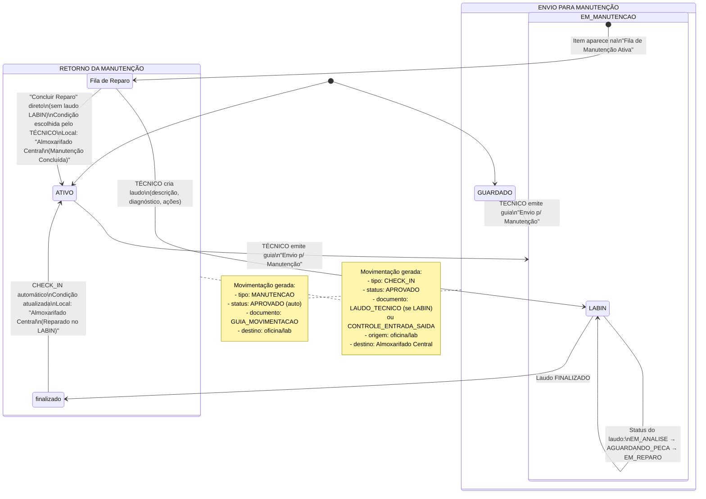

# Diagrama de Fluxo: Manutenção de Item



## Atores e Permissões

| Etapa | Quem faz | Perfil mínimo |
|---|---|---|
| Emitir guia de manutenção | Técnico no painel Movimentações | TÉCNICO |
| Ver fila de reparo | Qualquer um na tela Manutenção | Qualquer |
| Criar laudo técnico | Técnico na tela LABIN | TÉCNICO |
| Concluir reparo (sem laudo) | Técnico na tela Manutenção | TÉCNICO |
| Finalizar laudo e retornar item | Técnico na tela LABIN | TÉCNICO |

## Estados do Item

```
ATIVO ──(envio)──▶ EM_MANUTENCAO ──(reparo concluído)──▶ ATIVO
                                                          │
GUARDADO ─(envio)──▶ EM_MANUTENCAO ──────────────────────┘
```

## Caminhos de Retorno

| Caminho | Onde | O que acontece |
|---|---|---|
| **A - Direto** | Tela Manutenção → "Concluir Reparo" | TÉCNICO escolhe condição pós-reparo → CHECK_IN → ATIVO |
| **B - Via LABIN** | Tela LABIN → Laudo FINALIZADO | Laudo com diagnóstico técnico → CHECK_IN → ATIVO |

## Tabelas Afetadas

| Operação | Tabela | Campo alterado |
|---|---|---|
| Envio | `movimentacoes` | INSERT tipo=MANUTENCAO |
| Envio | `itens` | status → EM_MANUTENCAO |
| Reparo | `laudos` | INSERT/UPDATE (se LABIN) |
| Retorno | `itens` | status → ATIVO, condicao atualizada, localizacao_atual atualizada |
| Retorno | `movimentacoes` | INSERT tipo=CHECK_IN |
