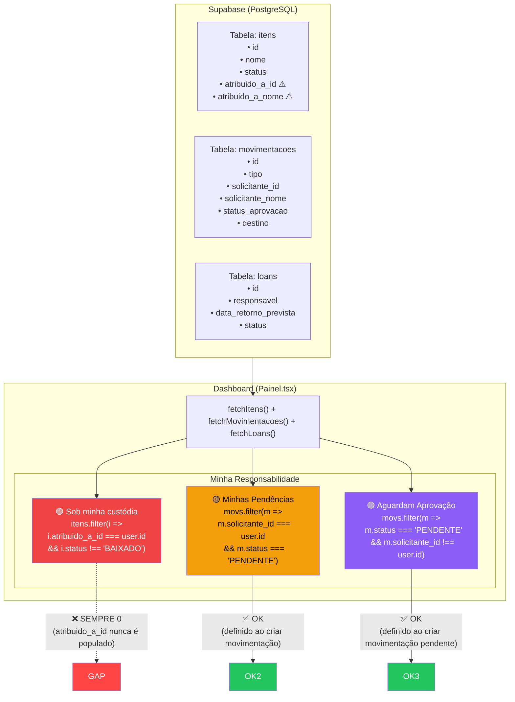

# Diagrama: "Minha Responsabilidade" — Dashboard



## Análise do Gap

| Card | Coluna usada | Quem escreve | Funciona? |
|---|---|---|---|
| Sob minha custódia | `itens.atribuido_a_id` | **NINGUÉM** | ❌ Sempre 0 |
| Minhas Pendências | `movs.solicitante_id` | `handleSave()` ao criar movimentação | ✅ |
| Aguardam Aprovação | `movs.status_aprovacao` | `handleSave()` / `handleApprove` | ✅ |

## O Problema

O campo `atribuido_a_id` existe na tabela `itens` e na interface TypeScript, mas **nenhum código no sistema o popula**. Nem:

- Cadastro de item (Inventario.tsx)
- Movimentação rápida (Inventario.tsx quick move)
- Emissão de guia (Movimentacoes.tsx)
- Conclusão de reparo (Manutencao.tsx)
- Finalização de laudo (Labin.tsx)
- Criação de empréstimo (Emprestimos.tsx)

O Dashboard lê corretamente, mas nunca há dados para ler.

## Solução

O `atribuido_a_id` deveria ser populado quando um item é **transferido para um usuário** ou **atribuído a um responsável**. Opções:

1. Na movimentação rápida (transferência), perguntar "atribuir a qual usuário?" e preencher o campo
2. Na emissão de guia de trânsito, vincular o destino a um usuário
3. No cadastro de item, campo opcional "responsável inicial" (revertemos isso, mas é válido)

## Back ≠ Front — Diagnóstico

```
Frontend lê:  itens.atribuido_a_id === user.id  →  espera encontrar dados
Backend escreve:  NUNCA  →  atribuido_a_id sempre é NULL
Resultado:  "Sob minha custódia: 0"  eternamente
```

O gap não é de comunicação técnica (Supabase ↔ React funciona perfeitamente), é de **lógica de negócio**: o fluxo que deveria preencher a custódia simplesmente não foi implementado em lugar nenhum.
